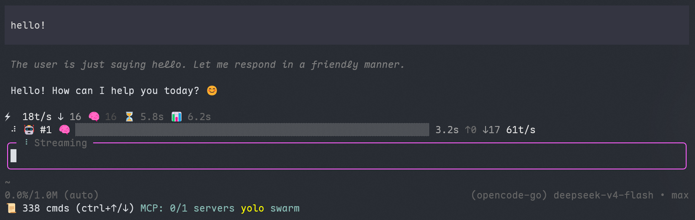

# pi-muselinn-harness


**Kimi Code-style agent orchestration harness for the [Pi coding agent](https://pi.dev)** — Swarm + Goal + Plan + Permission + Task + Hooks + Skills + TUI, an eight-module architecture that builds the features Pi deliberately skips (sub-agents, plan mode, …) and aligns them with Kimi Code's subsystem behavior.

[中文文档](README.zh-CN.md) · [Project page](https://muselinn.github.io/pi-muselinn-harness/) · [pi.dev catalog](https://pi.dev/packages)



## Install

```bash
pi install npm:pi-muselinn-harness
```

Or from git / local source:

```bash
pi install git:github.com/MuseLinn/pi-muselinn-harness
pi install local:~/.pi/agent/extensions/pi-muselinn-harness
```

## Features

### Swarm
- **In-process subagents** — `createAgentSession()` execution, `coder` / `explore` / `plan` types
- **Real concurrency control** — `runProgressive()` worker pool with true `max_concurrency` cap + exponential backoff retries
- **30-minute timeout** — per-subagent `AbortSignal.timeout` (aligned with Kimi Code)
- **run_in_background** — whole swarm goes to a background task, early task-ID return, report written to `output_path`
- **Smart model routing** — task-aware selection from `ctx.modelRegistry`
- **Braille progress bars** — driven by real tool-call progress, 250 ms frames with a state-fingerprint gate (unchanged frames cost nothing)
- **Harness-branded spinner** — single-width braille rotation by default (`PI_MUSELINN_SPINNER=braille|pulse|bounce|moon`, incl. Kimi moon-phase compat)
- **Adaptive layout** — pi-tui Component protocol, status bar width adapts to the terminal (10–60)
- **Three-pane task browser** — status glyphs (○ pending / ◐ running / ✓ done / ✗ failed / ▲ aborted), strikethrough on done rows, overflow collapse (`+N more`, running kept first), named keybindings, `ctrl+shift+t`
- **Cancel / resume** — UserCancellationError + AbortSignal chain, two-step `/cancel`

### Goal
- **Lifecycle** — active / paused / blocked / complete / usage_limited / budget_limited
- **Active Guard** — `create_goal` refuses to silently overwrite an active goal (`replace=true` or `/goal replace`)
- **Blocked 3-turn threshold** — three consecutive blocks for the same reason before really blocking
- **Completion-criterion gate** — a declared criterion must be verified before completing
- **Triple budget checks** — tokenBudget + turnBudget + wallClockBudgetMs (`turns/tokens/ms/s/minutes/hours`)
- **Goal Queue** — FIFO + high/normal priority + auto-switch + prioritize/drop/skip
- **Persistence** — appendEntry + session_start restore
- **Context injection** — `<untrusted_objective>` tag into the system prompt
- **Recovery** — compaction preservation + context-overflow detection + 429 detection

### Plan
- **Plan mode** — the LLM explores, writes a plan, and only executes after approval
- **Tool restrictions** — read-only tool whitelist + plan-file write access; bash gated by command whitelist
- **ExitPlanMode reads the plan file** — presentation matches what was actually written to disk
- **Path guard** — `path.resolve` + `startsWith(planDir)` against escape
- **Context injection** — the plan is injected into the system prompt

### Permission
- **18-level policy chain** — `auto` / `yolo` / `manual`; safety policies (destructive, sensitive files) short-circuit before modes
- **Destructive detection** — `rm -rf` / `git push --force` / `drop table` / `git reset --hard` regex recognition, always asks, never short-circuited by session approvals
- **Sensitive-file guard** — `.env` / `id_rsa` / `*.key` read/write interception, even in auto mode
- **Session approval fingerprints** — approvals remembered per sessionId + input fingerprint, never degrading into "permanent allow"
- **Approval panel** — numbered dialog with per-tool action titles ("Run this command?" / "Apply these edits?"), digit-key direct select, four outcomes: Allow once / Always allow (session) / Deny / Deny with reason (reason relayed to the model)
- **Subagent gating** — swarm worker tool calls run through the same policy chain (shared in-process manager): `/mode` switches propagate to in-flight subagents by construction, `ask` verdicts degrade to blocks (never silent approval)
- **AGENTS.md hierarchy** — project (nearest `AGENTS.md` or `.kimi-code/AGENTS.md`) → global `$KIMI_CODE_HOME/AGENTS.md` → cross-tool `~/.agents/AGENTS.md`, aggregated; `destructive-ask-always` can upgrade ask to deny
- **Config cache** — permission config cached by file mtime, edits take effect immediately

### Task (background + cron)
- **run_background** — subagent in the background, immediate task ID; `output_path` pages full output via Read
- **30-minute timeout** — background tasks auto-fail (`stopReason=timeout_30min`)
- **task_list / task_output / task_stop** — `active_only` filter, `block+timeout` waiting, `offset/limit` paging
- **50-task cap** + **7-day stale cleanup** + orphaned tasks degrade to `process_restart` on restart
- **Incremental persistence** — single-task changes append a single entry; restore stays compatible with old snapshots
- **Cron** — 5-field cron (local timezone) + deterministic jitter (10% of period, ≤15 min) + recurring/one-shot + 50 cap + 7-day stale auto-delete

### Hooks
- **Kimi Code-aligned `[[hooks]]` engine** — reads `$KIMI_CODE_HOME/config.toml` (default `~/.kimi-code/config.toml`) + project `.kimi-code/config.toml`; event/matcher/command/timeout fields
- **Full event coverage** — UserPromptSubmit / PreToolUse / Stop (blockable) + PostToolUse / PostToolUseFailure / PermissionRequest / PermissionResult / SessionStart / SessionEnd / SubagentStart / SubagentStop / StopFailure / Interrupt / PreCompact / PostCompact / Notification
- **Exit-code semantics** — `0` allow (stdout appended as context), `2` block (stderr as reason), anything else / timeout / crash fails open; stdout JSON `permissionDecision: deny` supported
- **Built-in TOML mini-parser** — zero dependencies; invalid rules warn and skip without breaking the extension; mtime-cached hot reload
- **Safety net** — Stop auto-disables after 3 consecutive blocks (anti-loop); every trigger mirrored to `pi.events` for other extensions

### Skills
- **Seven-scope pi-native scanning** — project `.pi/skills`, `.kimi-code/skills` (Kimi compat), `.agents/skills` → user `~/.pi/agent/skills`, `~/.pi/skills`, `$KIMI_CODE_HOME/skills`, `~/.agents/skills`; pi-native dirs win, Kimi dirs as compat layer, dedupe by name
- **Directory + flat forms** — `SKILL.md` subdirs (with auxiliary files) and single `.md` files; full frontmatter fields (name/description/type/whenToUse/disableModelInvocation/arguments, kebab/snake variants)
- **Available to subagents** — swarm and background subagent sessions receive skills via resourceLoader; the main session is injected via `resources_discover` (collision-free: only files from dirs pi does not scan natively, minus names pi already provides)
- **Zero-dependency frontmatter parser** + mtime directory-tree cache

### TUI
- **Closed-box editor** — Kimi Code's `wrapWithSideBorders` ported: pi-tui's horizontal-only borders post-processed into a `╭╮│╰╯` closed box; spinner + working state (Thinking/Streaming/Running tools) embedded in the top border; three styles `plain | boxed | compact` (pi-spark-style info border = compact), default boxed; model name opt-in via `"modelInBorder": true`
- **`/tui` command** — hot-switch styles without restarting (pi preserves text/focus/keybindings when swapping editors); `/tui timing` shows render timing; config persisted to `~/.pi/agent/muselinn-tui.json` (project `.pi/` override)
- **Plan badge** — `plan` text badge on the top border while plan mode is active (no border recoloring — zero conflict with pi's thinking-level colors)
- **Timing probe** — `PI_MUSELINN_HARNESS_TUI_TIMING=1` records editor `render()` P50/P99; spinner only ticks at 250 ms while the agent works

> Note: a pi-spark-style BottomFiller pseudo-fullscreen was implemented, then removed — it only has visual effect when the conversation is shorter than one screen. True editor pinning needs alternate-screen support in pi-core.

### Ask (interactive questions)
- **`ask_user_question` tool** — the agent asks the user numbered single-select questions (multi-question sequences supported); digit keys 1-9 jump straight to an option, arrows/jk navigate, Esc cancels
- **Shared dialog component** — the same numbered component backs permission approval; in print/RPC mode the tool returns the questions as text instead of blocking
- **Auto-mode safe** — auto mode denies `ask_user_question` by policy (no unattended hangs)

### Todo (inline task plan)
- **`todo_list` tool** — update (full-list rewrite) / read / clear; the model's plan stays visible to the user between turns
- **Inline panel** — above-editor widget with Kimi Code's folding strategy (all in_progress first, earliest pending, one slot for the most recent done); `ctrl+t` expand/collapse
- **Session persistence** — survives hot-reload; a fresh session always starts with an empty panel

### Web fetch
- **`fetch_url` tool** — no-auth URL fetch (20s timeout, 5MB stream cap, redirect follow); HTML → readable text (dependency-free extractor), JSON → pretty-print, everything else raw; 20k char cap with `max_chars` tuning

### Plugins (declarative bundles)
- **`muselinn.plugin.json`** — six declarative capabilities: `skills` (skill dirs merged into discovery), `sessionStart` (context injected on the session's first turn), `hooks` (merged into the `[[hooks]]` engine), `commands` (.md files become slash commands), plus `mcpServers` / `interface` recorded with skipped-diagnostics
- **Discovery** — project `.pi/plugins/*/` then user `~/.pi/agent/plugins/*/`, first-wins name dedupe; `/plugins` lists capabilities and diagnostics

### Output truncation
- **Oversized tool results spill to disk** — results over 40k chars are written to `<sessionDir>/tool-results/` and replaced in context with a sanitized head+tail preview carrying the `output_path` and read-paging instructions (Kimi `toolResultTruncation` pattern)

## Kimi Code alignment

Against the [Kimi Code CLI docs — Agents & Subagents](https://www.kimi.com/code/docs/kimi-code-cli/customization/agents.html):

| Capability | Status | Notes |
|------------|--------|-------|
| Three built-in subagent types (coder/explore/plan) | ✅ | coder=read/write+bash; explore=read-only; plan=read-only, no shell |
| Context isolation | ✅ | Independent sessions; only final results flow back |
| Parallel dispatch + max_concurrency | ✅ | Real worker-pool cap + progressive launch |
| 30-minute timeout | ✅ | Per-subagent AbortSignal.timeout |
| Background execution (run_in_background) | ✅ | Early task-ID return, blockable task_output, report to output_path |
| Resume an existing subagent | ⚠️ | Conservative semantics: same-id re-run; resume validated (saved state + nothing in flight + remaining items); true session resume pending pi-coding-agent API |
| Nested subagents (coder spawning more) | ❌ | Deliberately closed — no recursive dispatch; subagent toolset excludes agent/agent_swarm |
| Permission inheritance | ✅ | Worker tool calls pass through the shared policy chain; /mode propagates by construction; asks degrade to blocks |
| Instruction-file hierarchy | ✅ | Project `AGENTS.md` / `.kimi-code/AGENTS.md` → `$KIMI_CODE_HOME/AGENTS.md` → `~/.agents/AGENTS.md` |
| wire.jsonl session persistence | ❌ | Subagents use SessionManager.inMemory() (in-process lifecycle) |
| Hooks (`[[hooks]]` lifecycle) | ✅ | All 16 events, exit-code/stdout-JSON block semantics, fail-open |
| Agent Skills (four scopes) | ✅+ | Kimi's four covered and extended to seven pi-native scopes; directory + flat forms; subagent + main-session channels |

## Commands

| Command | Description |
|---------|-------------|
| `/swarm on\|off` | Toggle swarm mode |
| `/cancel` | Cancel current work (two-step confirm) |
| `/resume` | Resume an interrupted swarm |
| `/tasks` | Task browser (`ctrl+shift+t`) |
| `/goal <objective>` | Set a goal |
| `/goal pause\|resume\|cancel\|replace` | Manage the goal |
| `/goal budget <n> <unit>` | Set a budget (turns/tokens/ms/s/minutes/hours) |
| `/goal queue` / `/goal add\|prioritize\|drop\|skip` | Queue operations |
| `/plan` / `/plan on\|off\|clear` | Plan-mode control |
| `/mode` | Switch permission mode (auto/yolo/manual) |
| `/tui` | Switch editor style (plain/boxed/compact), `/tui timing` |
| `/plugins` | List loaded plugins and their capabilities |
| `/swarm-status` | Show status |
| `ctrl+t` | Expand/collapse the todo panel |

> `/goal` `/swarm` `/plan` `/mode` `/tui` all support Tab completion.

## Tools

| Tool | Description |
|------|-------------|
| `agent_swarm` | Batch parallel subagents (`max_concurrency` / `run_in_background` / `output_path` / `model_map`) |
| `agent` | Single subagent |
| `create_goal` / `get_goal` / `update_goal` / `set_goal_budget` | Goal management |
| `enter_plan_mode` / `exit_plan_mode` | Plan mode |
| `ask_user_question` | Numbered single-select questions to the user |
| `todo_list` | Model-driven task plan with inline panel |
| `fetch_url` | No-auth URL fetch with content-aware extraction |
| `run_background` / `task_list` / `task_output` / `task_stop` | Background tasks |
| `cron_create` / `cron_list` / `cron_delete` | Cron jobs |

## Architecture

Core/adapter split: `packages/core/` is pure logic with **zero pi imports**
(the future `@muselinn/core` package / MusePi fork foundation); the repo
root holds the pi adapter (entry, pi-tui components, tool registration).

```
pi-muselinn-harness/
├── index.ts               entry (agent_swarm/agent tools, background runner, module wiring)
├── state.ts               shared state
├── packages/core/         @muselinn/core — pure logic, no host imports
│   ├── ports.ts           host contracts (PersistencePort, ScopeDirs)
│   ├── text-utils.ts      visibleWidth & friends
│   ├── shell-output.ts    control-sequence sanitizer
│   ├── truncation/        oversized tool-result spill (pure)
│   ├── webfetch/          HTML→text / JSON extraction (pure)
│   ├── completions.ts     slash-command argument completions
│   ├── ask/               question spec + formatting (pure)
│   ├── todo/              todo model + Kimi folding strategy (pure)
│   ├── plugin/            muselinn.plugin.json manifest parse/discovery
│   ├── goal/              Goal module (state machine, budgets, queue, persistence)
│   ├── plan/              Plan module (tool whitelist, path guard, injection)
│   ├── permission/        Permission module (18-level chain, approval contract)
│   ├── hooks/             Hooks module (TOML mini-parser, executor, 16 events)
│   ├── skills/            Skills module (frontmatter, seven-scope scanner)
│   ├── swarm/             pure swarm half
│   │   ├── types.ts       state/constants (+ goal re-export)
│   │   ├── helpers.ts     braille bars / layout / spinner (memoized)
│   │   ├── estimator.ts   progress estimation (geometric mean)
│   │   ├── widget-lines.ts braille grid line builders (pure)
│   │   ├── wrap-tools.ts  permission gate wrapper (pure)
│   │   ├── resume-guard.ts resume ownership/idle validation (pure)
│   │   ├── report.ts      swarm report formatting
│   │   └── task-list-utils.ts collapse + key routing
│   ├── task/              cron + task persistence state (pure)
│   └── tui/               box/config/parse/switch/timing (pure chrome parts)
├── swarm/                 adapter: subagent execution, /swarm commands,
│                          SwarmWidgetComponent, three-pane task browser
├── task/                  adapter: background task manager (session spawn)
├── tui/                   adapter: MuselinnEditor + event wiring
├── ask/                   adapter: question dialog + ask_user_question tool
├── todo/                  adapter: todo_list tool + inline panel widget
├── webfetch/              adapter: fetch_url tool
├── plugin/                adapter: plugin loader + /plugins command
└── tests/                 node-level unit tests (below)
```

## Tests

Pure node-level unit tests, no model quota needed (362 assertions):

```bash
node tests/permission.test.mjs                    # Permission policy chain + subagent gate — 19
node tests/goal.test.mjs                          # Goal state machine — 17
node tests/cron.test.mjs                          # Cron subsystem — 16
node tests/hooks.test.mjs                         # Hooks engine — 43
node tests/skills.test.mjs                        # Skills scan/parse/scopes/discover — 38
node tests/tui.test.mjs                           # TUI collapse/keys/completions/spinner — 56
node tests/tui-box.test.mjs                       # TUI box/config/probe/switch — 61
node tests/ask.test.mjs                           # ask spec/digits/answers/approval titles — 24
node tests/todo.test.mjs                          # todo model + folding strategy — 19
node tests/shell-output.test.mjs                  # output sanitizer — 21
node tests/truncation.test.mjs                    # tool-result spill — 13
node tests/resume-guard.test.mjs                  # swarm resume validation — 6
node tests/webfetch.test.mjs                      # web extraction — 12
node tests/plugin.test.mjs                        # plugin manifest/discovery — 17
```

## Experimental branches

- [`feature/math-renderer`](https://github.com/MuseLinn/pi-muselinn-harness/tree/feature/math-renderer) — renders `$$...$$` display math in assistant messages via [txm](https://github.com/thatmagicalcat/txm) (cell-based 2D typesetting, works in Windows Terminal; no image protocol). Context-safe: the original Markdown is restored before every LLM call. Enable with `/tui math on` after `cargo install txm`.

## Roadmap

- **MusePi** — the fork track: `@muselinn/core` is extracted (Phase 1 done, `packages/core/` has zero pi imports); next is a self-developed incremental renderer replacing pi-tui with a pi extension API compat layer. See `MusePi-PLAN.md` and `RESEARCH-kimi-code.md`
- **i18n** — bilingual harness UI text and notifications (docs are already split en/zh-CN; the project page has an EN/中 toggle)
- **Math renderer graduation** — merge `feature/math-renderer` once compaction-path context safety is confirmed
- **Clustered diff preview** — kimi-style ±3-line clustered diffs in edit/write approval messages (deferred from the P1 batch)
- **True fullscreen** — container-swap fullscreen (kimi tasks-browser pattern); no alt-screen, preserving terminal scrollback

## Dependencies

- Pi >= 0.80.0
- `@earendil-works/pi-coding-agent`, `@earendil-works/pi-ai`, `@earendil-works/pi-tui` (peers)
- `typebox`

**No companion extensions required** — the harness is fully functional standalone. Optional companions that improve the experience:

- [`@juicesharp/rpiv-ask-user-question`](https://www.npmjs.com/package/@juicesharp/rpiv-ask-user-question) — lets swarm's model routing ask you interactively instead of deciding itself (the tool descriptions reference `ask_user_question`; without it the model just picks a model)
- [`@juicesharp/rpiv-todo`](https://www.npmjs.com/package/@juicesharp/rpiv-todo) — live todo overlay; the task browser borrows its status-glyph/overflow semantics but does not require it

## Acknowledgments

Design and implementation inspired by these open-source projects:

### [Kimi Code](https://github.com/MoonshotAI/Kimi-code) (Moonshot AI)
- Agent Swarm concurrency architecture (max_concurrency worker pool, 30-min timeout, run_in_background)
- Goal system design (GoalActor tracking, Budget Report, blocked 3-turn threshold, context injection)
- Plan-mode lifecycle (enter/exit/approve/reject, ExitPlanMode disk read)
- Permission policy chain (auto/yolo/manual, destructive-always-ask, AGENTS.md priority)
- Cron scheduling (5-field + jitter + 7-day stale + 50 cap)
- TUI component design (braille progress bars, three-pane task browser, `wrapWithSideBorders` closed-box editor)
- Cancel/resume mechanism (AbortSignal chain, UserCancellationError)

### [pi-spark](https://github.com/zlliang/pi-spark) (zlliang)
- Editor top-border info slots (spinner + working state + model embedded in the border)
- Component-replacement TUI customization path (`setEditorComponent` / `setFooter` / `setWidget`)

### [@narumitw/pi-goal](https://www.npmjs.com/package/@narumitw/pi-goal) (narumitw)
- Goal Queue FIFO + auto-switch mechanism
- usage_limited / budget_limited state design
- Wrap-up instruction injection (post-budget behavior)
- Stale Tool Blocking design
- Compaction retention policy

### [pi-codex-goal](https://www.npmjs.com/package/pi-codex-goal) (fitchmultz)
- Goal persistence (appendEntry + session_start restore)
- Goal state transitions
- Budget checking
- Recovery Machine concept (simplified)

---

**Note**: this extension is mostly an independent implementation. Exception: `tui/box.ts`'s `wrapWithSideBorders` is ported from Kimi Code (MIT), with attribution kept in comments and used under the MIT license.

## License

[MIT](LICENSE)
